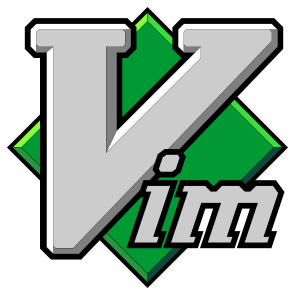

# vim_logo

The classic Vim logo.

<picture>
  
</picture>

There are a few versions of this kicking around, but to me *the* Vim logo is the svg on vim.org. There are several bits of "character" that set it apart:

* the geometrically impossible bevel shading
* un-skewed details on top of the skewed letter m
* the diamond is masked off begind the void spaces between the downward strokes of the m
* different bevel widths and even different outline widths on the letter V

The logo is interesting, but there are a lot of problems with the file on vim.org:

* different methods used to create outlines. This would prevent you from sending the logo to a vinyl cutter.
* nearly every bevel is different
* white polygons are used to cover errors and add details. You could not easily edit the vim.org file to have a clear background.
* a lot of errors and degenerate polygons in the file
* etc.

It looks like it's been through various authors with varying levels of skill. Worse, it wasn't made in Vim. This version was.

## I made it *almost* as close as possible to the original.

I didn't want to "fix" the character of the logo, but I did want to fix the errors. There are a few differences you may notice:

* smaller xy bevels on the face of the letter v. The original impossible bevel shading was accomplished by pushing points around to make things line up and by using occasional "graph paper bevels" (the gap between angled lines is less than the gap between horizontal or vertical lines). With a little trig, everything can line up without any kludges, but that means a fixed ratio between the face xy bevels and the bevel xy bevels.
* the top, right corner of the m is different. The downstrokes of the original are not parallel. To address this, I had to change that corner, but not much.
* the colors of the diamond bevels are different. The face color is the same "Vim green" as the original, but the shading is different. Plenty of notes on that in the source files.
* the alignment of the diamond is different. The original diamond is off center and crooked. I centered it and made it straight.
* the black line around im looks thicker. The width is the same. The original cut away some of areas with white polygons (I think by mistake).

Lot's of notes in the source files. I tried to make it as easy as I could for my future self to edit this later.

Find the file in `output/vim_logo.svg`.
